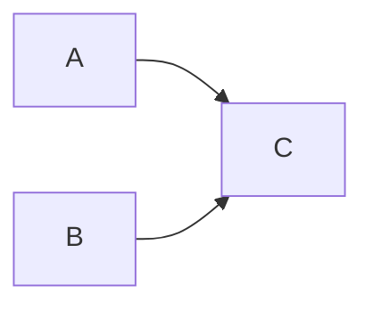

Making noise with zig

# Goals

- learning the basics of zig
- reimplementing the node diagram approach of [faust](https://faust.grame.fr/)
- having fun

# General approach

Noize is composed of nodes. Each node is defined by its inputs, outputs, internal state and eval function.

There are nodes defined for a variety of basic functions, and special nodes called operators.

Operators are used to combine nodes with each other, effectively connecting outputs to inputs in various ways. Inputs and outputs of the resulting nodes are derived from the combined nodes.

Evaluation is done by calling the eval function of the root node with an array storing inputs, and an array to store outputs.

All nodes are defined at compile time. Operators check at comptime that combined nodes are compatible, input/output wise. Also, no memory is allocated during runtime which is kind of cool.

Noize uses [jack](https://jackaudio.org/) as a backend to access audio hardware.

# Roadmap

- [x] proof of concept, operators and basic nodes, audio backend
- [ ] more examples in a separate folder instead of main.zig
- [ ] add OSC endpoints to the backend
- [ ] #syntax declare constant inputs at comptime
- [ ] #syntax [FAUST's iterations](https://faustdoc.grame.fr/manual/syntax/#iterations)
- [ ] node graph visualization
- [ ] more basic nodes
- [ ] [build a simple reverb](https://medium.com/the-seekers-project/coding-a-basic-reverb-algorithm-part-2-an-introduction-to-audio-programming-4db79dd4e325)

# Devlog

## Fri Dec  8 22:17:47 CET 2023

There is something crazy cool to do with tuples.

1. define node's input and output as slices of types
2. generate corresponding tuple types with `std.meta.Tuple`
3. redefine eval as `eval(input: InputTuple, output: OutputTuple)`

And now I can pass tuples from one eval call to the next. It is also possible to concat tuples together, and if I need to split them, I can use `inline for` to iterate over.

Experiment is [here](./exp/tuple.zig), but this approach is so promising, integrating it in the main code is the next step.

## Sat Dec  9 20:26:46 CET 2023

The tuple experiment has been merged into the main codebase. Note that it raises a segfault at compile time with zig 0.11.0 but not with master.

## Wed Dec 13 09:14:43 CET 2023

Interfacing with C is not easy. I'm almost there with jack - registering a client, opening input and output ports, running a process callback - but the C API is leaking everywhere.

So in the end I'm writing jack bindings - but I guess someone already did the work ? I've just found https://machengine.org/pkg/mach-sysaudio/ and it looks like I could use that ...

## Thu Dec 14 07:10:22 CET 2023

It's alive! the jack backend is working!

## Fri Dec 15 15:33:22 CET 2023

Experimenting with @Vector. Audio backends are usually asking for samples in frames. Passing vector types as inputs and outputs and adapting the code accordingly would allow to process a whole frame at once and make good use of the SIMD capabilities of the processor.

But to define a vector, I have to know its length at comptime. It means I would need info such as frame size and sample rate defined at comptime, but those informations are usually gathered at runtime (at least for jack).

Also : so far, Sin is the only node that stores a variable internal state (its phase). This information led me to add a `step` parameter to the `eval` method, in order to pass this information around. Is it the right approach ?

## Wed Dec 20 14:00:29 CET 2023

Things are generally working, which is cool. But I think having samplerate and framesize set at comptime would be more convenient.

For example, With delay max length declared at comptime, I have to declare it in samples because samplerate is runtime defined - so no conversion is possible.

Earlier I hesitated to declare those values at comptime because they are usually known at runtime. But worst case scenario, a program could defined a list of valid samplerates, and generate one `Noize(srate)` type for each, and use only one. That would only make the program a bit heavier.

## Sun Dec 24 20:57:38 CET 2023

I experimented with vector types. Here is what I learned from it:

- my first algorithm to vectorize oscillators was completely wrong. The phase shift is step*freq for each step of the vector, and freq can be variable. So, to compute the phase vector, I need a scan function to accumulate.
- I did some performance testing, comparing using vector types with regular sample per sample approach, and vector types are slower. I'm probably doing something wrong?

## Thu Feb 15 18:24:51 CET 2024

I should move back to a more simple implementation with arrays of f64 as inputs and outputs, and reorganize the code in a proper lib.

## Wed Feb 28 23:42:06 CET 2024

v0.1.0 released ! The code should be usable as a lib, and values passed around nodes are arrays of f32, like Faust.

## Wed Apr  3 16:59:12 CEST 2024

What about buffers ?

I could create a node that takes a buffer address at comptime, and write its input in the buffer, looping over when reaching the end. That writer should output its current write index. Other nodes could access this buffer and read it in various ways. A buffer of length=1 is a special case where one can store a node's output at a memory address, so other nodes can access it.

I think decoupling buffers that way is a good move. But comptime known length can be limiting ...

## Sat Apr 20 15:56:39 CEST 2024

Recently I discovered [fluent](https://github.com/andrewCodeDev/Fluent) - a lib to do slice manipulations with function chaining. I found their approach so elegant I had to use it for noize.

Now, operators are methods of node types. For example, if you wanted to build this:



With the previous API, it would be:

```zig
noize.Seq(noize.Par(A,B), C);
```

With the new API, it becomes:

```zig
A.par(B).seq(C);
```

To achieve that, you just have to add the following line in your node definition, and it will inherit all the apropriate methods:

```zig
pub usingnamespace noize.NodeInterface(@This())
```

## 2024-05-27 : rethinking things entirely

Sometimes, you want muliple nodes to share some data - for example, one node is filling a buffer with audio input, while multiple nodes are reading from the same buffer.

Unfortunately, my approach with comptime defined computational graph makes it tricky to do - if I create a node `Buffer(200)`, an array of `[200]f32` will be attached every time a node of that type is created, but I failed to find a way to access that memory from elsewhere - all I can do is pass data around through the node's inputs and outputs.

But what if my nodes could pass around more than `f32` ? Say, arbitrary data, as I was doing originally? **If you can do that, you can pass around a pointer to a buffer!**

Suddenly, a lot of things are possible. Our buffer of `f32` takes two inputs: the address of the buffer, and the value to write. It returns the index of the last value written.

Want to build a multi-tap delay? Just write the audio input in a buffer, define a `Tap` that takes a buffer address, a write index and a delay time, and add as many as you need to your graph.

Want to read audio from a file? Just fill a buffer with the file's content, and pass the buffer's address to the Node that will read it! Loading can even happen in a separate thread, so we don't allocate memory in the audio rendering thread.

Arbitrary inputs and outputs opens up many other possibilities. Here is a non-exhaustive list:

- trigger with a boolean
- enums to choose a value in a discrete list
- optionals to express events ?

## 2024-06-06 usability

Now that I have introduced buffers, I tried to write a simple multi-tap delay. Turns out it is rather complicated. I must admit my little experiment has a very poor usability. It is much more verbose than FAUST (I expected that) but in the end not really easier to read.

In essence, any audio processing is passing data through a digraph - each node processes its input to generate its output and pass it along the graph. At the end, the nodes unmatched inputs and outputs are the program's inputs and outputs.

I think most audio libraries are following a patch metaphor: define ugens at comptime, instanciate them at runtime and patch them together however you want. It is quite easy to reason about, because you get to declare each connection explicitely.

FAUST (and noize) takes a different approach to construct this digraph. Instead of nodes, FAUST defines a set of basic blocks, and a set of operators to combine those blocks into more complex blocks. The resulting data structure is a tree, but its evaluation can contain loops, thanks to the recursive operator. This is really powerful because the whole processing pipeline is defined at comptime, giving the compiler the opportunity to optimize things away.

Alas, this does not come for free. Blocks expose arrays of inputs and outputs, and operators don't address inputs and outputs individually. As blocks grow, it gets complicated to reason about.

